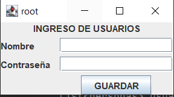
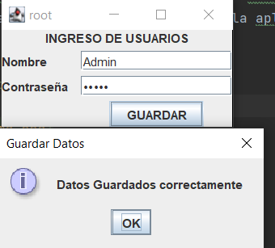
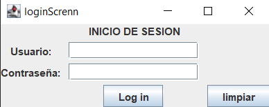
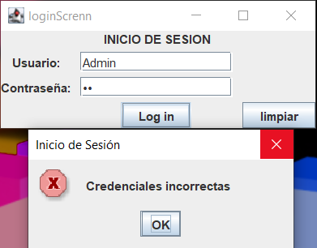
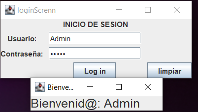
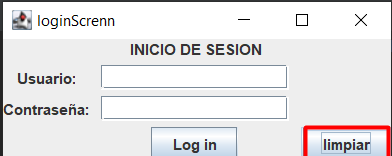

# Deber componentes swingx y archivos
## Instrucciones
1.- Implementar una aplicación que permita ingresar usuarios y los guarde en un archivo "usuarios.dat"

2.- Implementar una aplicación que tenga un form de login que nos redireccione a un segundo form donde se mostrará el nombre del usuario. El login y password deben ser validados desde un archivo binary "usuarios.dat" donde existan 5 usuarios con sus claves respectivas.

Entregables: Repositorio de github con readme detallado.

## Integrantes
- Juan Falconi
- Juan Gualotuña
- Heyet Tinoco

En este trabajo se realizo una interfaz la cual guarda la la informomacion de 5 usuarios dento de un archivo "usuarios.dat".
Al momento de ingresar datos equivocados la aplicacion mostrara un mensaje de error.

## Ejecucion
    Guardar datos.

    Ingreso de credenciales y verificacion de errores.

    Limpiar datos 

